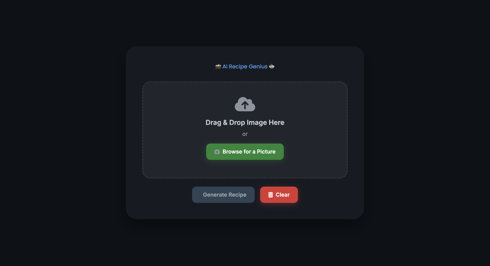

# 📸 AI Recipe Generator 🍲

Welcome to the **AI Recipe Generator**, a modern web app that uses Google's Gemini API to generate recipes from uploaded food images. Built with a sleek, premium dark theme using Tailwind CSS, this project offers a fast, elegant way to turn your dish photos into detailed cooking instructions.

---

## 🚀 Features

- Drag-and-drop or browse to upload an image of a dish
- Auto-generates a recipe based on the food image using the Gemini API
- Responsive and modern UI (built with Tailwind CSS)
- Smooth loading animations and dark theme
- Option to clear the image and result to start fresh

---

## 📸 Demo

---

## 🧰 Technologies Used

- **HTML, CSS, JavaScript**
- **Tailwind CSS** – for modern, responsive UI
- **Font Awesome** – for icons
- **Google Gemini API** – for generating recipe content from image
